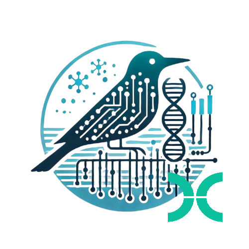

<p align="center">

</p>

# nf-BIRD


**Bacterial Identification and Resistance Detection**

nf-BIRD is nextflow implementation of [C-BIRD](https://github.com/Kincekara/C-BIRD) pipline. Altough there are minor changes to leverage Nextflow features, nf-BIRD is aimed to give same results with C-BIRD.

## Dependencies
nf-BIRD requires [Nextflow](https://www.nextflow.io/) workflow manager and a container runtime such as [Docker](https://docs.docker.com/engine/install/) or [Apptainer](https://apptainer.org/docs/admin/main/installation.html) to run. The required kraken2 and checkm2 databases that can be downloaded from the links below.

- [Kraken2/Bracken database](https://benlangmead.github.io/aws-indexes/k2)
- [CheckM2 database](https://zenodo.org/api/records/5571251/files/checkm2_database.tar.gz/content)

## Quick Start

### Installation
Install nf-BIRD via nextflow or git
```bash
# Nextflow
nextflow pull Kincekara/nf-BIRD

# Git
git clone https://github.com/Kincekara/nf-BIRD.git
```

### Input Requirements

- **Single Sample**: Requires paired-end FASTQ files (`read1` and `read2`).
- **Multiple Samples**: Requires a CSV samplesheet with the following columns:
  - `sample`: Unique identifier for the sample.
  - `fastq_1`: Path to the first read file.
  - `fastq_2`: Path to the second read file.

Example samplesheet:

```csv
sample,fastq_1,fastq_2
sample1,/path/to/sample1_read1.fastq.gz,/path/to/sample1_read2.fastq.gz
sample2,/path/to/sample2_read1.fastq.gz,/path/to/sample2_read2.fastq.gz
```

### Running the pipeline
```bash
# single sample
nextflow run /path/to/nf-BIRD -profile docker --samplename --read1 /path/to/read1.fast.gz --read2 /path/to/read2.fastq.gz --kraken2_db /path/to/k2_standard_08gb_20250402.tar.gz --checkm2_db /path/to/checkm2_database.tar.gz

# multiple samples
nextflow run /path/to/nf-BIRD -profile docker --kraken2_db /path/to/k2_standard_08gb_20250402.tar.gz --checkm2_db /path/to/checkm2_database.tar.gz --samplesheet /path/to/samplesheet.csv
```

### Outputs

- **results.tsv :** Tab delimeted table that mimics Terra. It includes all important stats and results for  all samples
- **Individual reports for each sample**
  - basic report
  - extended report
  - plain report
  - qc summary

- Outputs of each tool are located in program folders for troubleshooting.

# Disclaimer
The results generated by this pipeline should not be used as the sole basis for any clinical decision-making. Users are responsible for ensuring that the pipeline is used in compliance with all applicable laws, regulations, and guidelines. The authors and contributors of this pipeline do not assume any liability for any direct, indirect, incidental, or consequential damages arising from the use of the pipeline or the information generated by it. Additionally, please note that genotypic results obtained from this pipeline may not always correlate with phenotypic resistance profiles. It is essential to confirm any findings with appropriate phenotypic testing and clinical correlation.

